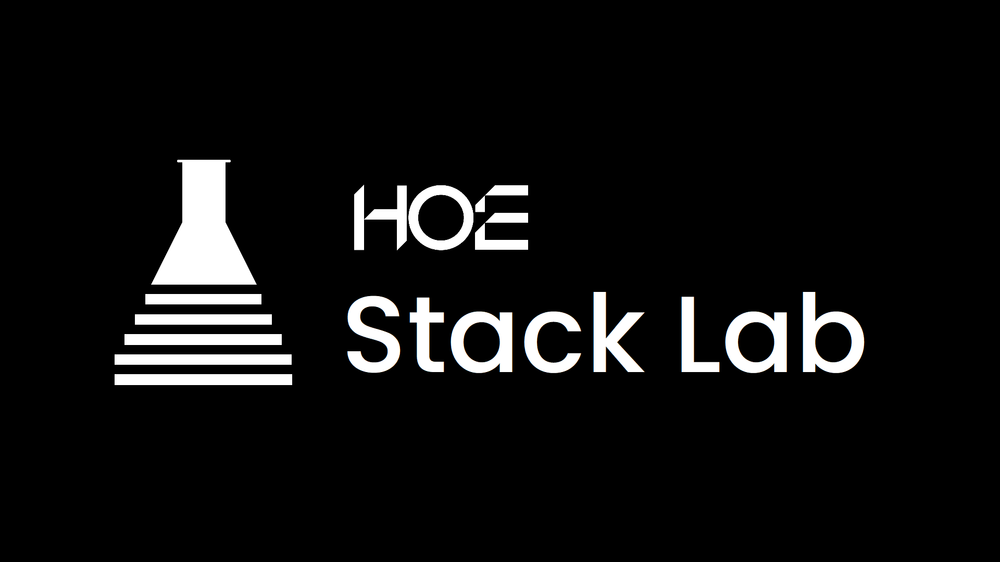

<div align="center" class="logo-container">
   
   
</div>


<div align="center" class="NPL text">
   <p>此项目属于 HOE Team Stack Lab <a href="https://github.com/HOE-Team">了解更多(暂时无法访问)[↗]</a></p>
</div>

<div align="center" class="Title">
    <h1>ComposeGal</h1>
</div>

<h4 align="center">使用 Jetpack Compose 编写一个 Galgame</h4>

<div align="center">

[](https://github.com/HOE-Team/ComposeGal)
[](https://github.com/HOE-Team/ComposeGal/blob/main/LICENSE)
[](https://github.com/HOE-Team/ComposeGal/releases)

</div>

## 项目简介
ComposeGal 是一个探索性的实验项目，旨在验证使用原生 Android 现代 UI 工具栈（Jetpack Compose）构建美少女游戏（Galgame）的可行性。项目通过数据驱动的设计模式，实现了剧情内容与底层渲染逻辑的彻底解耦。

> [!IMPORTANT]
> 这是一个**实验性项目**，使用了非常规的技术栈来编写。因此不保证项目的稳定性，但此项目会被长期维护。

## 特性
* **显示配置**：
    * **强制横屏**：锁定 sensorLandscape 模式，提供最适合 Galgame 游玩的视觉比例。
    * **全屏沉浸**：启用 Edge-to-Edge 渲染，消除系统状态栏干扰。
* **响应式引擎架构**：
    *基于 GameViewModel 的单向数据流管理，确保对话索引与 UI 渲染严格同步。
    * 异步脚本加载，支持从 assets 目录动态解析 JSON 剧情文件。
* **主菜单系统**：
    * 支持自定义本地背景图（bg.png）。
    * 预设“从头开始”、“加载存档”、“系统设置”交互入口。

## 技术栈
* **UI 框架**: Jetpack Compose
* **编程语言**: Kotlin 2.0.0 (JVM 17) 
* **依赖管理**: 版本目录 (Version Catalog / libs.versions.toml) 
* **核心库**：
    * `Lifecycle ViewModel Compose`: 状态管理
    * `Coil`: 高性能图片异步加载
    * `Kotlinx Serialization`: JSON 剧情解析 

## 快速开始

### 1. 环境要求
* Android Studio Ladybug | 2024.2.1 或更高版本。
* Target SDK: 36 (Android 16)/Min SDK 23 (Android 6.0)。
* JDK: 17。

### 2. 资源准备
请确保以下资源文件已就绪：
* **Logo**: `res/drawable/hoe_team.png` 与 `res/drawable/stack_lab.png`。
> [!TIP]
> 如果您要更改图片的文件名，您需要修改`ui.component.LogoSplash.kt`中的Line `31`、`32`、`38`、`39`
> ```kotlin
> Image(
>    painter = painterResource(id = R.drawable.hoe_team), //[修改此处]
>     contentDescription = "Hoe Team Logo", //[修改此处]
>     modifier = Modifier.size(120.dp)
> )
>
> Image(
>     painter = painterResource(id = R.drawable.stack_lab), //[修改此处]
>     contentDescription = "Stack Lab Logo", //[修改此处]
>     modifier = Modifier.size(120.dp)
> )
> ```
> 及app/src/main/res/drawable中的图片及文件名

> [!IMPORTANT]
> Android 资源文件名必须仅使用小写字母、数字和下划线，且必须以字母开头（例如 ic_logo_01.png）。

* **主页背景**: `res/drawable/bg.png`。
* **剧情**: `src/main/assets/story.json`。

### 3. 构建与运行
```bash
# 克隆仓库
git clone https://github.com/HOE-Team/ComposeGal

# 同步 Gradle 并运行
./gradlew installDebug
```

## 版权与许可证
版权所有 © 2026 HOE Team。保留所有权利。  

本项目采用 [**Apache-2.0**](LICENSE) 许可证开源。

> [!NOTE]
> 这份许可证意味着：
>
> **自由使用与分发**：你可以自由使用、修改、复制和分发本项目的代码，无论是个人项目还是商业项目。
>
> **宽松的再发布条件**：如果你修改并重新发布代码，**不需要**强制开源你的修改部分（不具“传染性”）。你可以将本项目代码闭源集成到你的商业软件中。
>
> **保留声明**：你必须在分发副本中保留原始的版权、专利、商标和归属声明，并附上一份 Apache 2.0 许可证副本。
>
> **专利授权**：许可证包含明确的专利许可授予，同时规定如果你针对本项目提起专利诉讼，相关专利授权将自动终止。
>
> **免责声明**：作者不提供任何明示或暗示的保证，使用该软件产生的风险由你自行承担。
